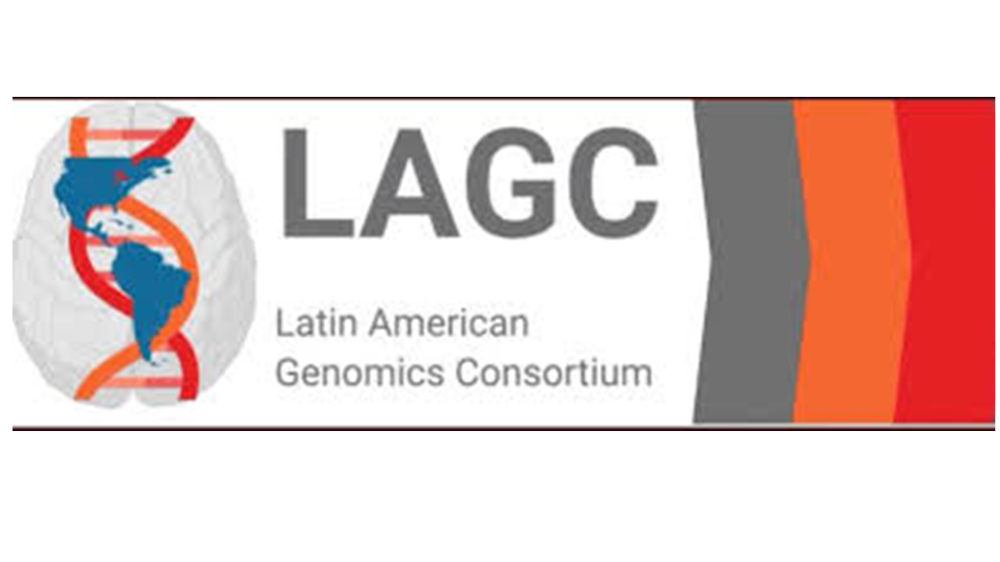

# Latin American Genomics Consortium (LAGC)

  

<b>Advancing psychiatric genomics research through collaboration across Latin America.</b>

---

## 🌎 About Us

The **Latin American Genomics Consortium (LAGC)** is an international research network dedicated to advancing psychiatric genomics research in Latin American populations through collaboration, data sharing, education, and methodological innovation.

Founded in **2019**, LAGC brings together investigators from Latin America and around the world to improve the representation of Latin American populations in genomic research and accelerate discoveries that lead to more equitable precision medicine. Today, the consortium includes **100+ active researchers** across Latin America, Puerto Rico, and the United States.

---

## 📫 Contact

**Website**
https://www.latinamericangenomicsconsortium.org

**Email**
latinamericangenomics@gmail.com

---

## 🎯 Our Mission

We aim to create a more inclusive future for psychiatric genomics by:

- Expanding genomic studies in Latin American populations
- Increasing sample sizes through international collaboration
- Developing methods for admixed populations
- Supporting recruitment and genotyping initiatives
- Promoting open science and reproducible research
- Providing education and training opportunities for investigators across Latin America

---

## 🔬 Research Areas

Our collaborative projects include:

- Psychiatric Genomics
- Genome-wide Association Studies (GWAS)
- Multi-omics Integration
- Polygenic Risk Scores
- Admixture-aware Statistical Methods
- Functional Genomics
- Cross-population Meta-analysis
- Transcriptomics
- Epigenomics
- Bioinformatics Tool Development

---

## 🤝 Collaboration

LAGC works closely with international initiatives including:

- Psychiatric Genomics Consortium (PGC)
- Universities across Latin America
- Research institutions in the United States and Europe
- Clinical cohorts throughout Latin America

Together, these collaborations help generate large-scale genomic resources while increasing diversity in psychiatric genetics research. 

---

## 📂 Organization Repositories

This GitHub organization hosts software, pipelines, documentation, and educational resources developed by members of the consortium.

Repositories may include:

- GWAS pipelines
- Statistical genetics tools
- Transcriptomic analysis workflows
- Multi-omics integration
- Polygenic Risk Score methods
- Bioinformatics utilities
- Tutorials and workshops
- Consortium documentation

---

## 📖 Open Science

We believe scientific software should be:

- Reproducible
- Transparent
- Well documented
- Open source
- Community driven

We encourage contributions from researchers, students, and developers interested in improving genomic research in underrepresented populations.

---

## 🌱 Get Involved

We welcome collaborators from:

- Genetics
- Genomics
- Psychiatry
- Neuroscience
- Bioinformatics
- Biostatistics
- Computer Science
- Data Science
- Medicine

Whether you are an established investigator or an early-career researcher, there are many ways to contribute.

---

## 📚 Resources

- Consortium Website
- Research Projects
- Educational Material
- Workshops
- Community Events

---
  
  ## 📚 Publications

**Murgueito J. et. al.** La importancia de incluir personas de ascendencia latinoamericana en estudios genéticos de trastornos de la ingesta y de la conducta alimentaria. Revista Puertorriqueña De Psicologia 2023, 34(2), 262-283.

**Bruxel, E. M., et al.** *Psychiatric genetics in the diverse landscape of Latin American populations.* **Nature Genetics** 57, 1074–1088 (2025).  

**da Silva, B. S., et al.** *Shaping the future of ADHD genetic research through ancestral diversity.* **Nature Mental Health** 4, 186–189 (2026).  

**Porras, L. M., et al.** *Functional Genomics Studies of Psychiatric Disorders in Individuals of Latin American Populations: A Scoping Review.* **American Journal of Medical Genetics Part B: Neuropsychiatric Genetics** 201(4), 227–245 (2026).  

---

## Citation

If you use software or resources developed by the LAGC, please cite the corresponding publication and acknowledge the Latin American Genomics Consortium.

---

## License

Unless otherwise specified, repositories are released under their respective open-source licenses.

---

<b>Together, we are building a more inclusive future for psychiatric genomics.</b>

